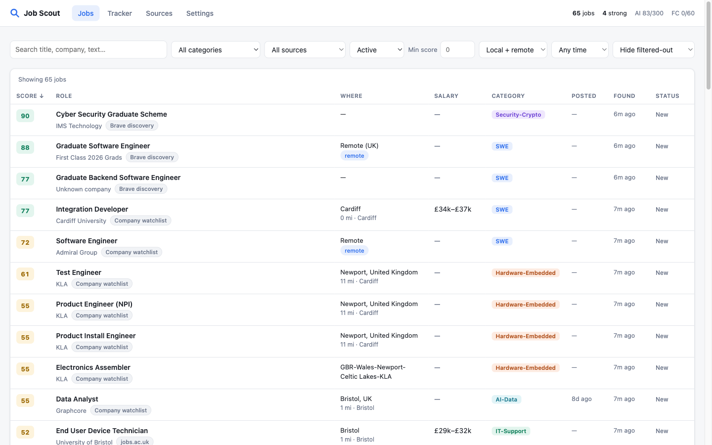
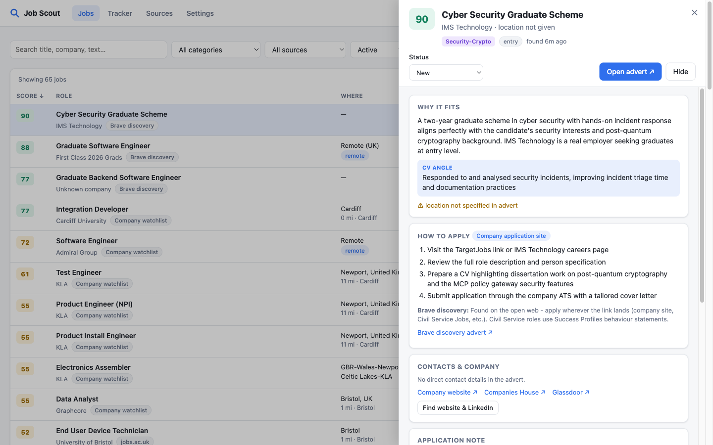
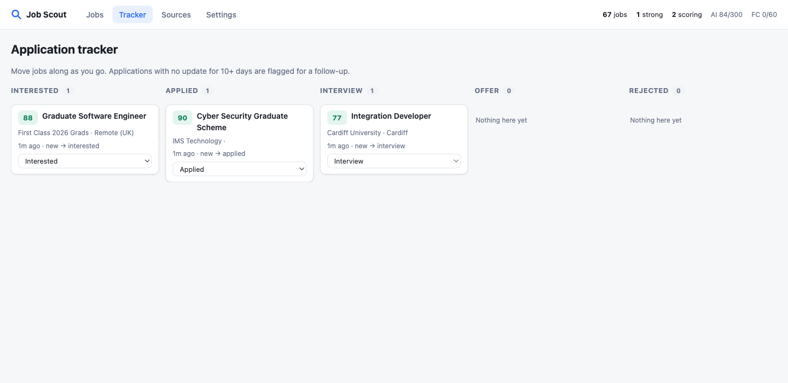
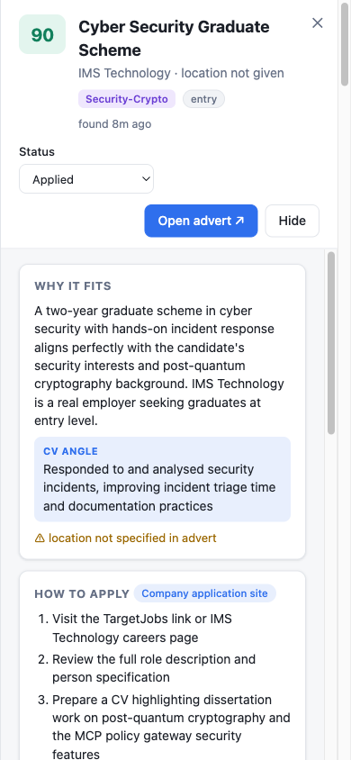

# Job Scout

An always-on job finder for early-career software engineers. It pulls vacancies from job-board APIs, university and
employer careers systems, scraped boards and web search. It merges duplicates, filters by commute distance and
seniority, and has Claude score each remaining role against the candidate's profile. Everything appears in a web UI
with sorting, source-specific application instructions, contact details, drafted application notes and an application
tracker. Strong matches trigger a push notification through Home Assistant.

Built for my own search: a Software Engineering graduate (post-quantum cryptography dissertation) looking for a first
role around Cardiff, South Wales, Bristol or remote.



| Job detail | Tracker | Mobile |
|---|---|---|
|  |  |  |

## How it works

```mermaid
flowchart LR
  subgraph Collect
    A[Adzuna API] & R[Reed API] & U[jobs.ac.uk] & W[Employer ATS APIs<br/>Greenhouse · Workday · Lever · Ashby]
    F[Boards via Firecrawl<br/>Find a Job · Indeed · Gumtree · CWJobs · NHS] & B[Brave web search]
  end
  Collect --> N[Normalise + dedupe<br/>URL cleaning, company/title fingerprint]
  N --> G[Geocode<br/>postcodes.io → OSM Nominatim]
  G --> H[Hard filters<br/>radius · seniority · years · salary · age]
  H --> S[Claude Haiku scoring<br/>structured output]
  S --> DB[(SQLite)]
  DB --> UI[FastAPI + HTMX UI]
  DB --> HA[Home Assistant push]
  UI -- on demand --> C[Claude Sonnet<br/>application notes]
```



**It's a pipeline, not a free-running agent.** The deterministic steps (collection, dedupe, filtering) are cheap,
repeatable and testable. The model is only used for judgement: fit, category, the "CV angle", how to apply for this
particular advert, and contact extraction. That keeps the cost at about £0.003 per job and makes results
explainable.

Design points worth a look:

- **Use APIs before scraping.** Adzuna and Reed have official APIs. Many employers expose public applicant-tracking
  endpoints (Greenhouse, Workday's CXS JSON, Lever, Ashby, SmartRecruiters), which are exact and free. Scraping is
  only used for boards without an API. Firecrawl renders those pages to markdown for 1 credit each, and Haiku
  extracts the listings. That's 5× cheaper than Firecrawl's own JSON mode.
- **Change detection.** "Page" watchlist entries are hashed, so the LLM extraction only runs when a careers page
  actually changes.
- **Deduplication.** Each job gets a fingerprint from its normalised title, company (with suffixes like
  Ltd/Limited/PLC removed) and location, plus a cleaned URL. The same role found on Reed and Adzuna becomes one
  row that lists both sources.
- **Geocoding.** OS Open Names (postcodes.io) indexes Welsh places by their Welsh name ("Casnewydd", not
  "Newport") and only covers Great Britain. So only city/town matches on either name are accepted, and anything
  else goes to OpenStreetMap Nominatim. Nominatim is rate-limited to 1 request/second and biased toward the search
  centres. Results are cached in SQLite.
- **Structured outputs.** `messages.parse()` with Pydantic models means the pipeline never repairs JSON. Search
  results often arrive with jumbled titles ("Company | Job"), so the scoring call also returns the advert's real
  title, company and location. The location filter then re-runs on the corrected values.
- **Budgets.** Daily caps on AI calls and Firecrawl credits, a free SQLite call counter, and Brave throttled to its
  free tier's 1 request/second.
- **Concurrency.** APScheduler runs the collectors in threads over SQLite in WAL mode. Geocoding happens before
  any write transaction opens, so a long ingest never deadlocks against the cache writes.

## Features

- **Jobs:** sort by score, date, salary, distance or company. Filter by category, source, status, remote, minimum
  score and age, or search free text. A "new since last visit" marker, and deep links (`/?job=123`).
- **Job drawer:**
  - the model's reasoning, a concrete CV bullet you could earn in the role, and red flags
  - **How to apply:** steps for this specific advert, plus site-specific guidance (Indeed profile CV, Gumtree
    reply form, university supporting statements, Civil Service Success Profiles)
  - contacts from the advert, the company's website and LinkedIn (via Brave), Companies House and Glassdoor links
  - timestamped notes and status history
  - **Fetch full advert & re-score**
  - **Draft application note**, in the format that fits the application route
- **Tracker:** a board from Interested to Offer, with follow-up flags on applications that have gone quiet for
  10 days or more.
- **Sources:** the last and next run for each source, found / new / merged / filtered / scored counts, errors, and
  *Run now*.
- **Settings (all in the UI):**
  - profile in markdown bullets, CV upload (PDF, DOCX or MD), and a profile + CV / profile-only / CV-only switch
  - search centres and radii, remote on/off with a remote penalty, minimum salary, maximum advert age
  - search terms for each source type, seniority words, excluded keywords, maximum years of experience asked for,
    and score adjustments per category
  - sources on/off with run intervals, and the company watchlist
  - Home Assistant alerts with quiet hours and a test button
  - model choice, daily budgets, and *Re-score all*

## Running it

```bash
cp .env.example .env          # add the keys you have - sources without keys switch themselves off
uv sync
uv run uvicorn app.main:app --port 8080
```

Or with Docker (this is how it runs 24/7 on a Raspberry Pi 5):

```bash
docker compose up -d --build
curl localhost:8080/healthz
```

Data (SQLite + uploaded CV) lives in `./data`. Starting settings come from `config/defaults.yaml`. After the first
run, the Settings page is the source of truth.

| Key | Used for | Cost |
|---|---|---|
| `ANTHROPIC_API_KEY` | scoring, extraction, application notes | ~£0.003 per job scored |
| `ADZUNA_APP_ID` / `ADZUNA_APP_KEY` | Adzuna search | free |
| `REED_API_KEY` | Reed search | free |
| `BRAVE_API_KEY` | web discovery, company lookup | free tier |
| `FIRECRAWL_API_KEY` | boards without APIs, JS careers pages | 1 credit per page |
| `HA_TOKEN` | push alerts via Home Assistant | free |

Indeed and LinkedIn don't allow automated access in their terms. Those two sources are off by default and are meant
only for occasional personal use.

## Tests

```bash
uv run pytest
```

The tests cover:
- dedupe and merging across sources, the radius filter, and remote handling
- seniority, years-of-experience and age filters
- salary and URL parsing
- source parsers, run against saved fixtures
- the LLM layer with a mocked client: score adjustment, field normalisation for search results, and the daily budget

## Stack

Python 3.13 · FastAPI · HTMX · SQLModel/SQLite · APScheduler · httpx · selectolax · Anthropic SDK · Docker
